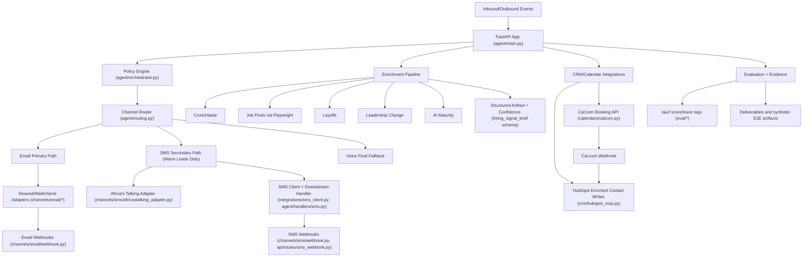

# Interim Report (Day 0 + Early Implementation)

## 1) Architecture Overview
The system is organized into orchestration (`agent/`), channel adapters (`channels/` + `integrations/`), enrichment (`enrichment/`), CRM/calendar integration (`crm/`, `calendars/`, `api/routes/`), evaluation (`eval/`), and evidence/probe layers (`evidence/`, `probes/`). A single FastAPI app wires policy checks, routing, and webhooks.

## 1.1) System Architecture Diagram (Components + Directional Flows)

## 1.2) Internal Consistency Callout (Diagram <-> Text <-> Code)
- Diagram node `FastAPI App` maps to `agent/main.py`, which includes webhook routers and the routing endpoint.
- Diagram node `Policy Engine` maps to `agent/orchestrator.py` and policy modules under `agent/policies/`.
- Diagram node `Channel Router` maps to `agent/routing.py`, where channel hierarchy is enforced:
  - Email is primary when email exists.
  - SMS is secondary and only selected for warm leads.
  - Voice is fallback when SMS is blocked/not eligible or no digital channel exists.
- Diagram email path maps to `channels/email/resend_adapter.py` and `channels/email/webhook.py`.
- Diagram SMS path maps to `channels/sms/africastalking_adapter.py`, `integrations/sms_client.py`, `agent/handlers/sms.py`, `channels/sms/webhook.py`, and `api/routes/sms_webhook.py`.
- Diagram CRM/calendar link maps to `calendars/calcom.py`, `calendars/webhook.py`, and `crm/hubspot_mcp.py`, where booking events trigger HubSpot updates.
- Diagram enrichment path maps to source loaders in `enrichment/tenacious/` and the structured schema in `knowledge_base/tenacious_sales_data/schemas/hiring_signal_brief.schema.json`.

## 2) Key Design Decisions
- Added a hard kill switch: `ALLOW_REAL_PROSPECT_CONTACT=false` by default.
- Implemented explicit dry-run behavior in email/SMS/HubSpot flows under kill switch.
- Kept downstream interfaces explicit in handlers to avoid hidden side effects.
- Split provider-specific logic into `integrations/*_client.py` for testability.

## 3) Production Stack Verification
- Resend: outbound client + inbound webhook handler implemented.
- HubSpot: enriched upsert payload and Cal.com-triggered update path implemented.
- Cal.com: booking webhook route implemented; booking client scaffold added.
- Langfuse: smoke script exists (`smoke_langfuse.py`); full trace push requires real keys.
- SMS (Africa's Talking): outbound + inbound webhook implemented.

## 4) Enrichment Pipeline Status
- Crunchbase/job/layoff/leadership/AI maturity signal loaders exist.
- Job-post collection currently uses Playwright on public pages.
- No login logic or captcha bypass has been added.
- Next step: merge signals into a unified per-signal confidence artifact for every prospect run.

## 5) Competitor Gap Brief (Test Prospect)
A synthetic brief exists for SavannaPay in the end-to-end thread artifact, identifying platform-hardening pressure and a pilot wedge. It is synthetic and should be replaced with a real prospect brief before final submission.

## 6) Tau2-Bench Baseline and Methodology
Baseline metadata is stored in `eval/score_log.json` and `eval/trace_log.jsonl`.
- pass@1: 0.7267
- 95% CI: [0.6504, 0.7917]
Method: retail domain, 30 tasks, 5 trials/task, aggregated pass@1 with CI from official run output.

## 7) Latency (p50/p95 from 20+ interactions)
Current p50/p95 values are from benchmark traces, not yet from 20 live email+SMS interactions. Live interaction sampling is pending credentials and webhook deployment.

## 8) What Works / What Does Not / Remaining-Day Plan
What works:
- Core FastAPI scaffold
- Email and SMS inbound/outbound paths
- HubSpot + Cal.com webhook bridge
- Eval artifact structure

What does not yet:
- Full real-provider E2E run with credentials
- Official 20-interaction live latency sample
- Final enrichment artifact contract enforcement across all signals

Remaining-day plan:
1. Run live credential tests on Render URL.
2. Capture 20+ real interaction latency sample and publish p50/p95.
3. Finalize competitor gap brief from one real prospect.
4. Re-run smoke + submission checklist and lock release branch.
